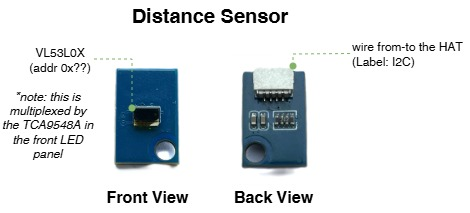
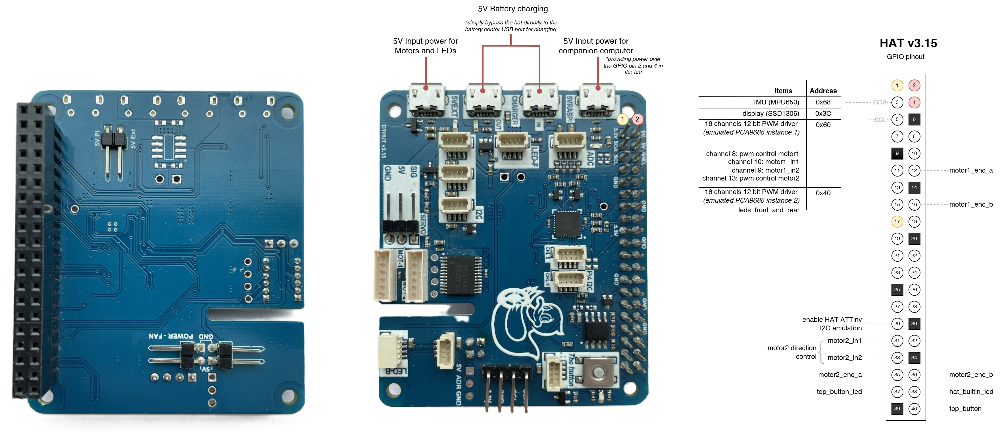

# Hardware Pinouts

## Distance sensor

## Inertial Measurement Unit (IMU)

mpu6050

TBA

## LEDs

## Display

## HAT

## Motors

## Battery

TBA

## Jetson Nano

## Camera

- [RPi Camera (G) OV5647, 5MP, Wider Field of View, Adjustable Focus - Product page](https://www.waveshare.com/rpi-camera-g.htm)
- [RPi Camera (G) - Waveshare Wiki](https://www.waveshare.com/wiki/RPi_Camera_(G))
