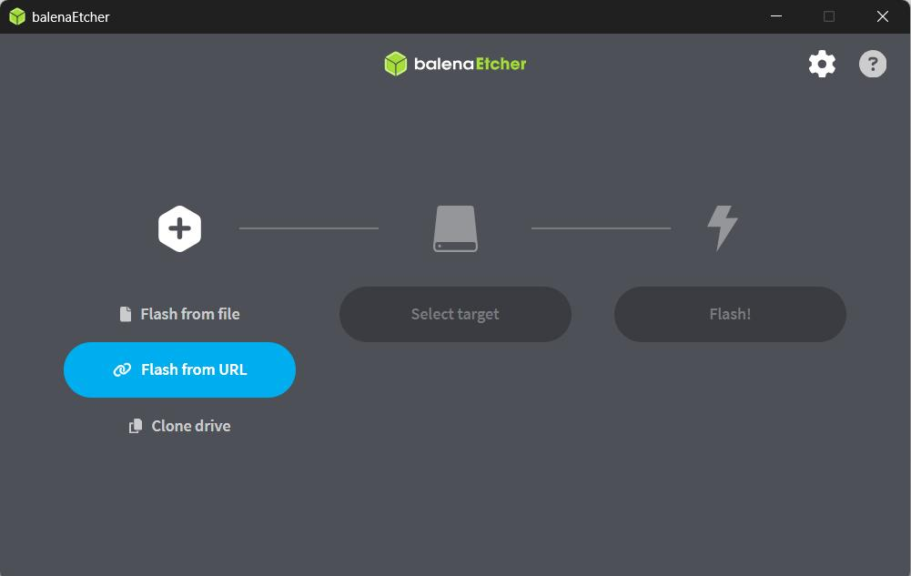
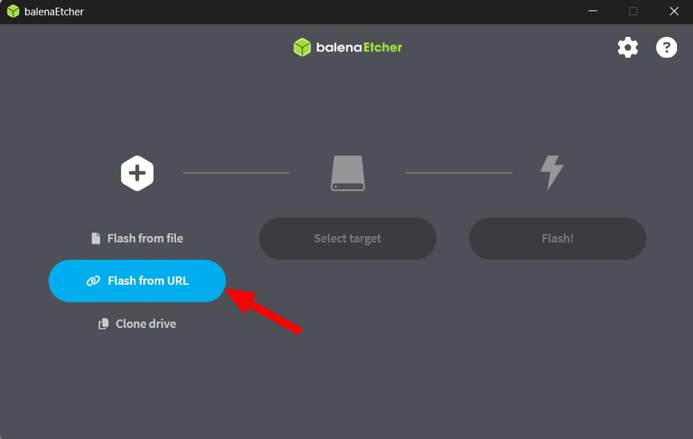
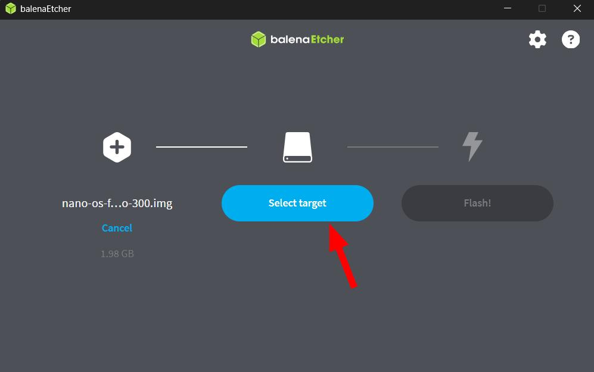
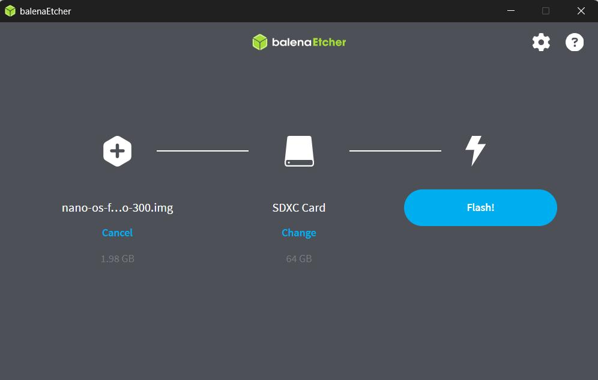
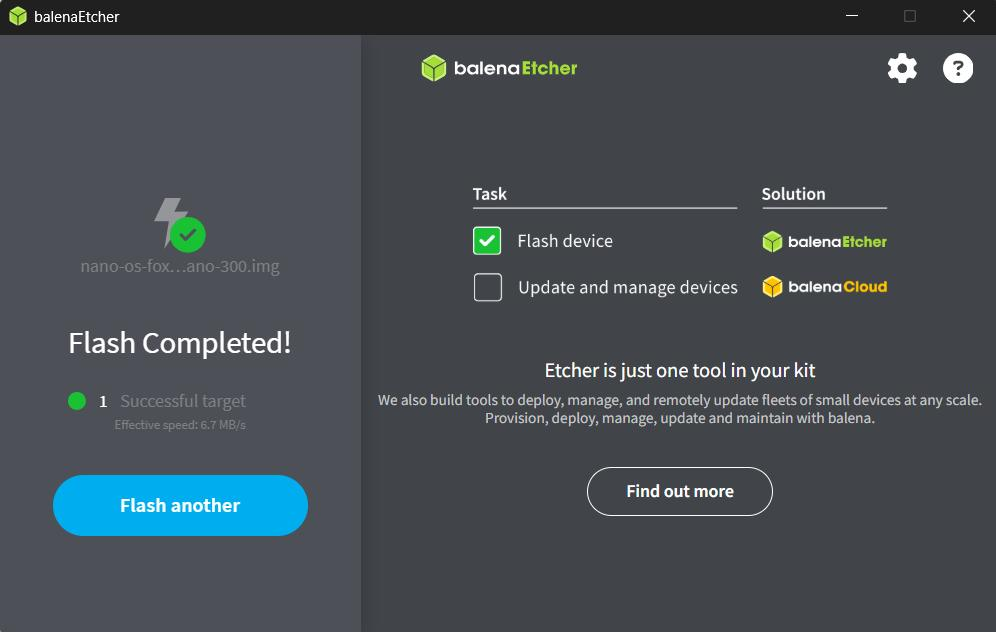
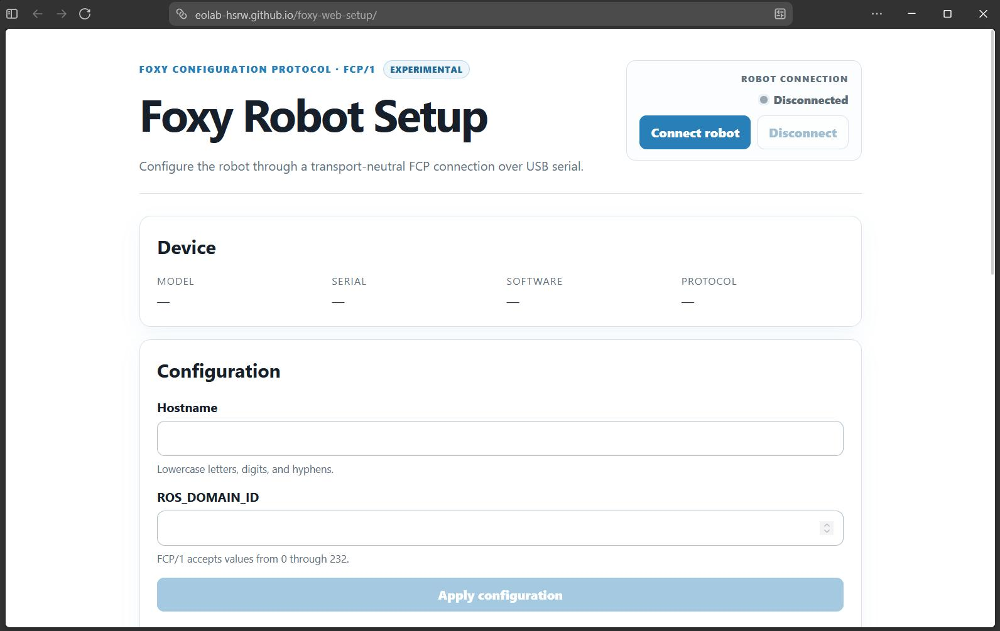

# Robot Setup

This guide explains how to install the Foxy system image on a microSD card, start the robot, and complete the initial network configuration.

## Requirements

Before starting, make sure you have:

* A microSD card compatible with the robot
* A computer with a microSD card reader
* A data-capable micro-USB cable
* Access to a Wi-Fi network
* Permission to install software on your computer

> [!WARNING]
> Flashing the Foxy image will erase all existing data on the selected microSD card. Verify that you have selected the correct storage device before starting the flash operation.

## Flash the Foxy Image

<Steps>

<Step title="Install balenaEtcher">

Download and install [balenaEtcher](https://etcher.balena.io/).

balenaEtcher is used to write the Foxy system image to the microSD card.

After the installation is complete, open balenaEtcher.



</Step>

<Step title="Select the Foxy image">

In balenaEtcher, select **Flash from URL**.

Paste the following image URL:

```text
https://hochschule-rhein-waal.sciebo.de/public.php/dav/files/drB7RpdDq9C7edC
```

Confirm the URL and wait while balenaEtcher loads the image.



</Step>

<Step title="Insert the microSD card">

Insert the microSD card into your computer.

Use a suitable microSD card adapter or external card reader when required.

Wait until the operating system detects the card before continuing.

<Troubleshooting>

### The computer does not detect the microSD card

Try the following checks:

* Remove and reinsert the microSD card.
* Check that the card is inserted in the correct orientation.
* Try another USB port.
* Try another card reader or microSD adapter.
* Restart balenaEtcher after inserting the card.
* Check whether the card appears in your operating system's disk-management utility.

### The adapter has a lock switch

Some full-size SD card adapters have a physical write-protection switch.

Make sure the switch is in the unlocked position before continuing.

<!-- Add image: SD card adapter lock switch -->

</Troubleshooting>

</Step>

<Step title="Select the target">

In balenaEtcher, click **Select target**.

Select the microSD card that will be used in the robot.

Verify the target by checking its:

* Device name
* Storage capacity
* Connection type

> [!CAUTION]
> Check the device name and storage capacity carefully. Selecting the wrong target may erase another storage device connected to your computer.



<Troubleshooting>

### The microSD card is not listed

Try the following checks:

* Close the target-selection window.
* Remove and reinsert the microSD card.
* Wait for the operating system to detect it.
* Reopen the target-selection window.
* Restart balenaEtcher.
* Try another card reader or USB port.

### Multiple storage devices are listed

Do not select a device until you can identify the microSD card safely.

Compare the displayed capacity with the capacity printed on the card. When possible, disconnect unrelated USB storage devices before continuing.

</Troubleshooting>

</Step>

<Step title="Flash the microSD card">

Click **Flash** to begin writing the Foxy image to the microSD card.



balenaEtcher normally performs two operations:

1. Write the image to the microSD card.
2. Verify that the image was written correctly.

Do not remove the microSD card or disconnect the card reader while either operation is running.

Wait until balenaEtcher confirms that the flash operation completed successfully.



<Troubleshooting>

### The flash operation does not start

Check that:

* The correct target is selected.
* The microSD card is not write-protected.
* balenaEtcher has the permissions requested by your operating system.
* There is enough free storage space on your computer for temporary files.

### The flash operation fails

Try the following actions in order:

1. Remove and reinsert the microSD card.
2. Restart balenaEtcher.
3. Load the Foxy image again.
4. Try another USB port or card reader.
5. Try another microSD card.

### Verification fails

A verification failure indicates that the data read from the microSD card does not match the image that was written.

Do not use the card in the robot yet. Flash it again.

If verification fails repeatedly, replace the microSD card or card reader.

### The operation appears to be stuck

Large images can take several minutes to write and verify.

Before interrupting the process, check whether:

* The progress indicator is still changing.
* The card reader has an activity light.
* Your computer is still responsive.
* The microSD card or adapter was accidentally disconnected.

</Troubleshooting>

</Step>

<Step title="Remove the microSD card">

After balenaEtcher reports a successful flash, eject the microSD card using your operating system.

Wait until the operating system confirms that the card can be removed safely, then remove it from the computer.

> [!IMPORTANT]
> Do not remove the card while it is still being written, verified, or used by another application.

<Troubleshooting>

### The card cannot be ejected

Close applications that may still be accessing the card, including:

* balenaEtcher
* File Explorer or Finder windows
* Disk-management utilities
* Terminal sessions using the card's mounted directory

Try ejecting the card again.

### The operating system shows several new partitions

This is expected after flashing the Foxy system image.

Do not format or modify the new partitions, even if your operating system reports that some of them cannot be read.

</Troubleshooting>

</Step>

<Step title="Insert the microSD card into the robot">

Make sure the robot is not powered.

Locate the robot's microSD card slot and check the required card orientation.

Insert the flashed microSD card gently until it is seated correctly.

Do not force the card into the slot.

<Troubleshooting>

### The microSD card does not fit

Stop applying pressure and check:

* The card orientation
* Whether the correct slot is being used
* Whether another card is already inserted
* Whether the card or slot is visibly damaged

The card should enter the slot without significant force.

### The card does not remain in the slot

Some card slots use a push-to-lock mechanism.

Insert the card gently until you feel or hear it click into place.

</Troubleshooting>

</Step>

<Step title="Power on the robot">

Press the **battery button on the side of the robot** to power it on.

The side battery button is the robot's power-on control.

> [!IMPORTANT]
> The button on top of the robot is a user-programmable button. It is not the power button.

> [!NOTE]
> The battery button powers the robot on, but it does not perform a software shutdown. Shut down the operating system correctly before switching off or disconnecting the battery whenever possible.

<!-- Add image: side battery button and top user button -->

<Troubleshooting>

### The robot does not power on

Check that:

* The battery is connected correctly.
* The battery has sufficient charge.
* The flashed microSD card is fully inserted.
* You pressed the battery button on the side of the robot.
* You did not press the user-programmable button on top.

### The robot powers on but does not start correctly

The first startup may take longer than later startups.

Wait several minutes before restarting the robot.

If the robot still does not start:

1. Perform a proper shutdown when possible.
2. Switch off or disconnect the battery.
3. Remove and reinsert the microSD card.
4. Power the robot on again.
5. Reflash the microSD card if the problem continues.

<!-- Add image: robot power indicators -->

</Troubleshooting>

</Step>

</Steps>

## Post-Installation Setup

The robot uses the following hostname by default:

```text
robot
```

Changing the hostname is recommended, especially when multiple robots are used on the same network. A unique hostname makes each robot easier to identify and access.

Example hostnames include:

```text
foxy-01
foxy-02
foxy-lab-a
```

<Steps>

<Step title="Prepare the robot">

Make sure that:

* The flashed microSD card is installed.
* The robot is powered on.
* The robot has completed its initial startup.

The first startup may take several minutes.

<Troubleshooting>

### The robot is still starting

Wait several minutes after powering it on before connecting to the setup utility.

Check the robot's status indicators, if available, for signs that the system is still starting.

### The robot repeatedly restarts

Check that:

* The battery has sufficient charge.
* The microSD card is inserted correctly.
* The flash operation completed successfully.
* The microSD card passed balenaEtcher's verification step.

If necessary, reflash the microSD card.

<!-- Add image: normal startup indicators -->

</Troubleshooting>

</Step>

<Step title="Connect the robot to your computer">

Connect a data-capable micro-USB cable to the robot's micro-USB port.

Connect the other end of the cable to a USB port on your computer.

> [!TIP]
> Some micro-USB cables provide power only and cannot transfer data. Use another cable if the setup tool cannot detect the robot.

<Troubleshooting>

### The computer does not detect the robot

Try the following checks:

* Confirm that the robot is powered on.
* Disconnect and reconnect the micro-USB cable.
* Try another USB port.
* Try another micro-USB cable.
* Confirm that the cable supports data transfer.
* Avoid using an unpowered USB hub.
* Close applications that may already be using the USB connection.

### How to identify a power-only cable

A power-only cable may charge or power a device but will not create a USB data connection.

When uncertain, use a cable that is known to support file transfer with another device.

<!-- Add image: robot detected as USB device -->

</Troubleshooting>

</Step>

<Step title="Open Foxy Web Setup">

Open the [Foxy Web Setup](https://eolab-hsrw.github.io/foxy-web-setup/) utility in a supported web browser.

Follow the browser prompts to allow the website to connect to the robot.



<Troubleshooting>

### The browser does not show the robot

Check that:

* The robot is powered on.
* The micro-USB cable supports data transfer.
* The cable is connected securely at both ends.
* No other browser tab or application is using the robot's USB connection.

Then reload the Foxy Web Setup page and try again.

### The browser asks for device permission

Select the Foxy robot from the device list and approve the connection.

The website cannot communicate with the robot until this permission is granted.

### No device-selection dialog appears

Try the following:

1. Reload the page.
2. Disconnect and reconnect the USB cable.
3. Open the setup utility in a supported browser.
4. Close other applications that may be using the USB device.
5. Restart the browser.

<!-- Add image: browser USB permission dialog -->

</Troubleshooting>

</Step>

<Step title="Configure the hostname">

Enter a unique hostname for the robot.

Use a short, descriptive name containing:

* Lowercase letters
* Numbers
* Hyphens

Recommended examples:

```text
foxy-01
foxy-02
foxy-navigation
```

Avoid spaces, uppercase letters, underscores, and other special characters.

<Troubleshooting>

### The hostname is rejected

Check that the hostname:

* Contains only lowercase letters, numbers, and hyphens.
* Does not contain spaces.
* Does not begin or end with a hyphen.
* Is not already used by another robot on the network.

For example, use:

```text
foxy-01
```

Instead of:

```text
Foxy Robot 01
```

### The wrong hostname was entered

Correct the hostname before applying the configuration.

If the configuration has already been applied, reconnect to Foxy Web Setup and update it again.

<!-- Add image: hostname validation message -->

</Troubleshooting>

</Step>

<Step title="Configure the Wi-Fi connection">

Select the Wi-Fi network that the robot should use.

Enter the network credentials and apply the configuration.

Before continuing, verify that:

* The network name is correct.
* The password is correct.
* The network is accessible from the robot's location.
* The network allows new devices to connect.

<!-- Add image: Wi-Fi configuration -->

<Troubleshooting>

### The Wi-Fi network is not listed

Try the following checks:

* Move the robot closer to the wireless access point.
* Refresh the available network list.
* Confirm that the network is currently active.
* Check whether the network name is hidden.
* Verify that the robot supports the network's frequency and security configuration.

### The robot does not connect to Wi-Fi

Check that:

* The Wi-Fi password was entered correctly.
* The correct network was selected.
* The robot is within range of the access point.
* The network allows new devices.
* A captive portal or browser-based login is not required.
* The configuration was saved before rebooting.

Reopen Foxy Web Setup and apply the Wi-Fi configuration again when necessary.

### The network requires institutional credentials

Some university or enterprise networks require additional authentication, certificates, or device registration.

Ask the network administrator whether the robot can connect directly or whether a dedicated network must be used.

<!-- Add image: Wi-Fi connection error -->

</Troubleshooting>

</Step>

<Step title="Reboot the robot">

Use the reboot option in Foxy Web Setup to restart the robot.

The hostname and Wi-Fi configuration are applied after the robot restarts.

Wait for the robot to complete the reboot before disconnecting the micro-USB cable or attempting to access it over the network.

> [!CAUTION]
> Do not use the battery button as a normal software shutdown control. Use the reboot or shutdown option provided by the system whenever possible.

<Troubleshooting>

### The reboot command does not respond

Wait briefly and check whether the robot has already started rebooting.

If it remains unresponsive:

1. Reload Foxy Web Setup.
2. Reconnect to the robot.
3. Try the reboot command again.
4. Use a proper software shutdown option if one is available.

Only interrupt battery power as a last resort.

### The robot does not reconnect after rebooting

The reboot may take several minutes.

Check that:

* The robot remains powered.
* The Wi-Fi configuration is correct.
* The robot is within range of the access point.
* Your computer is connected to the same network.
* The configured hostname is correct.

Reconnect the micro-USB cable and open Foxy Web Setup again if the robot remains unavailable.

</Troubleshooting>

</Step>

</Steps>

